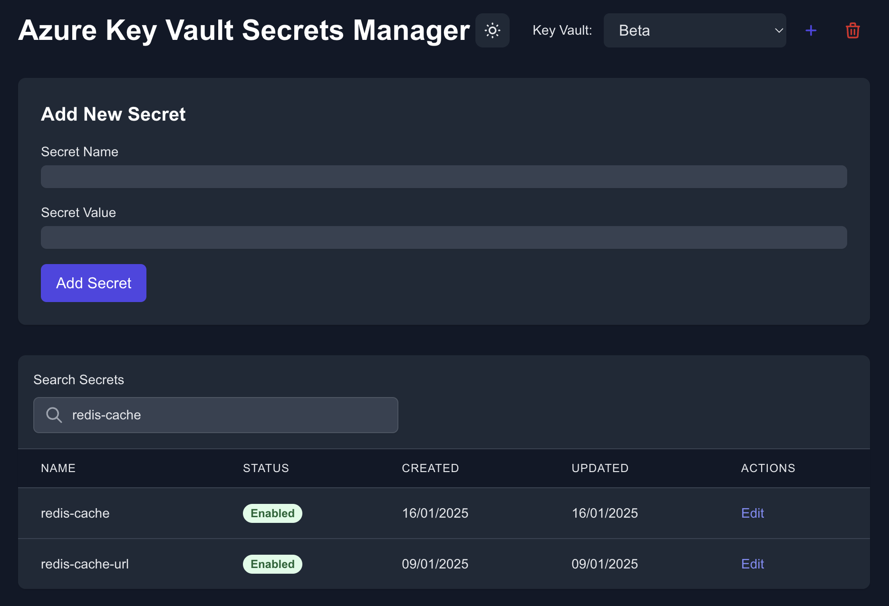

# Azure Key Vault Secrets Manager


A modern web application for managing secrets in Azure Key Vault. Built with Next.js, TypeScript, and Tailwind CSS.
This work and following readme is created with the help of Cursor AI.



## Features

- 🔐 Secure secret management in Azure Key Vault
- 🌓 Dark/Light mode support

## Prerequisites

- Node.js 18 or later
- Azure subscription
- Azure Key Vault instance
- Azure credentials with appropriate permissions

## Getting Started

1. Clone the repository:
```bash
git clone https://github.com/frozturk/akvui.git
cd akvui
```

2. Install dependencies:
```bash
npm install
```

3. Set up Azure authentication:
   - The application uses `DefaultAzureCredential` from `@azure/identity`
   - Make sure you're logged in with Azure CLI or have appropriate environment variables set

4. Start the development server:
```bash
npm run dev
```

5. Open [http://localhost:3000](http://localhost:3000) in your browser

## Usage

1. Add a Key Vault:
   - Click the "+" button in the header
   - Enter the display name and vault name

2. Manage Secrets:
   - View all secrets in the selected vault
   - Add new secrets with the form at the top
   - Edit existing secrets by clicking the "Edit" button
   - Search secrets using the search bar
   - View secret metadata (creation date, last updated)
   - See secret status (enabled/disabled)

## Security

- No secrets are stored locally
- All operations are performed directly with Azure Key Vault
- Uses Azure's managed identity for authentication
- Implements proper access controls
- HTTPS-only communication

## Development

- Built with Next.js 14 (App Router)
- TypeScript for type safety
- Tailwind CSS for styling
- Azure SDK for Key Vault operations

### Available Scripts

- `npm run dev` - Start development server
- `npm run build` - Build for production
- `npm start` - Start production server
- `npm run lint` - Run ESLint
- `npm run format` - Format code with Prettier

## Contributing

1. Fork the repository
2. Create your feature branch (`git checkout -b feature/amazing-feature`)
3. Commit your changes (`git commit -m 'Add some amazing feature'`)
4. Push to the branch (`git push origin feature/amazing-feature`)
5. Open a Pull Request

## License

This project is licensed under the MIT License - see the [LICENSE](LICENSE) file for details.
